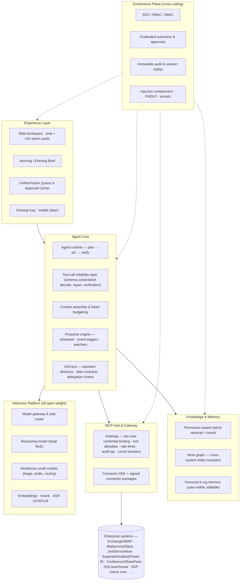

# UiOne AI — Product Strategy, Development Backlog & Strategic Gap Analysis

> **Status:** v1.0 draft — 2026-07-26 · **Owner:** Product · **Repo:** `caglarsubas/uione-ai`
>
> UiOne AI is a fully **on-premise**, **open-weight-only**, **MCP-native** enterprise assistant platform: the single workspace an employee greets every morning and works with all day — email, chat, tasks, incidents, claims, BI, reports, documents, meetings — with assistants that also collaborate with each other (A2A).

---

## Table of contents

1. [Executive summary](#1-executive-summary)
2. [Product thesis](#2-product-thesis)
3. [Reference architecture](#3-reference-architecture)
4. [Development backlog — 12 epics](#4-development-backlog--12-epics)
5. [Strategic gap analysis](#5-strategic-gap-analysis)
6. [Competitive positioning](#6-competitive-positioning-july-2026)
7. [Beachhead & sequencing recommendation](#7-beachhead--sequencing-recommendation)
8. [Phased roadmap](#8-phased-roadmap)
9. [Success metrics](#9-success-metrics)
10. [Top risks & mitigations](#10-top-risks--mitigations)
11. [Team shape](#11-team-shape)
12. [Open questions](#12-open-questions)
- [Appendix A — Model portfolio recommendation](#appendix-a--model-portfolio-recommendation-july-2026)
- [Appendix B — Connector availability matrix](#appendix-b--connector-availability-matrix-july-2026)

---

## 1. Executive summary

**The product in one sentence.** A sovereign "digital chief of staff" for every employee: it *acts* (writes back into enterprise systems, not just search), it's *proactive* (morning briefs, anomaly alerts, recurring reports), and it's *governed* (approvals, audit, on-prem, open weights).

**Ten takeaways from this analysis:**

1. **The unification is a data problem, not a UI problem.** Bolting 20 MCP connectors onto a chatbox produces a tool list, not a unified workspace. The moat is the **work graph** — cross-system entity resolution (this Jira ticket ↔ that email thread ↔ that incident ↔ that KPI) — which is what makes the morning brief coherent. It must be an explicit epic, not an emergent hope.
2. **Trust architecture is the adoption gate.** No enterprise lets an agent send email or close incidents day one. A **graduated autonomy framework** (risk-tiered actions → preview → approve → learn toward auto) with undo journaling is P0, not polish.
3. **Reading email + holding write-tools = the "lethal trifecta."** Untrusted content (inbound email/messages) + private data + the ability to act/exfiltrate is the canonical prompt-injection kill zone. Injection containment must be *architectural* (content quarantine, no instruction-following from tool output, recipient/URL allowlists), not a filter bolted on later.
4. **Permission-aware everything.** Retrieval and actions must mirror source-system ACLs exactly. One leaked salary document ends a deployment. This is the hardest engineering problem Glean solved and the one most open-source stacks skip.
5. **Open-weight tool-calling needs a reliability layer.** Open models miscall tools more than frontier closed models. Grammar-constrained decoding, schema validation, auto-repair, and read-after-write verification are core platform IP — they convert "model quality" risk into an engineering problem you own.
6. **Model churn is an advantage only with an eval harness.** Open-weight leaders change every quarter. An eval-gated model lifecycle (golden tasks per connector/workflow, shadow rollout) lets you ride the curve; without it every model swap is a regression lottery.
7. **The proactive engine must reduce noise, not sum it.** Aggregating every platform's alerts creates a worse inbox. Signal ranking, cross-system dedup (same incident via PagerDuty + chat + email = one card), and a per-user notification budget are the differentiating features of the brief.
8. **GPU economics decide viability.** Route most tokens to small models, reserve the large model for reasoning, run proactive/batch jobs off-peak, and ship a sizing calculator. On-prem customers buy hardware before they buy software.
9. **Employee privacy is a feature.** The platform sees everything an employee does. Aggregate-only admin analytics, a "what my assistant did" transparency page, and no manager-surveillance by design are required for works councils, KVKK/GDPR — and for employees to *want* the morning ritual.
10. **Beachhead discipline.** Ship 6 deep connectors and 3 killer workflows for one vertical (ops/incident-heavy teams in banking/insurance — where "claim management" and on-prem mandates already point) before going horizontal.

---

## 2. Product thesis

### 2.1 Why now

| Force | What changed |
|---|---|
| **Integration cost collapsed** | MCP is now industry-governed (donated to the Linux Foundation's Agentic AI Foundation, Dec 2025; Anthropic, OpenAI, Microsoft, Google, AWS all members) with **10,000+ public servers** and official servers from GitLab, Grafana, Superset, Metabase, Mattermost, Camunda, ServiceNow, Salesforce, SAP and more. The graveyard of "digital workplace hubs" died on N×M integration cost; that constraint is gone. |
| **Open weights reached "enterprise-agentic good enough"** | The open-to-closed capability gap has shrunk to an estimated **3–5 months**. MIT/Apache-licensed MoE models (GLM-5.x, DeepSeek V4, Qwen3.5/3.6, Kimi K-line) sit just behind the closed frontier on agentic benchmarks, while 30B-class MoE models with ~3B active params serve hundreds of concurrent users on a single ~$13K GPU. Notable shift: Meta exited open weights in 2026 — the open frontier is now led from China, with gpt-oss, Mistral, and Nemotron as the Western-origin alternatives (a portfolio fact with procurement implications — see risks). |
| **Sovereignty demand is hardening** | EU AI Act, GDPR/KVKK, sector regulators (banking data-locality rules, e.g. Turkey's BDDK), and geopolitics push regulated buyers off SaaS copilots. Microsoft/Google cannot follow into the air gap. |
| **A2A matured** | The Agent2Agent protocol hit **v1.0 (Mar 2026)** under Linux Foundation governance with 150+ member orgs (AWS, Microsoft, Google, SAP, ServiceNow, IBM) and official self-hostable SDKs in five languages. "My assistant talks to your assistant" is now standards-based, not a proprietary demo. The rival ACP protocol merged into A2A (2025); AGNTCY (LF) provides complementary discovery/identity infra. |

### 2.2 Who it's for

Primary: **regulated, on-prem-mandated enterprises** — banks, insurers, public sector, defense-adjacent, telcos, large manufacturers. Buyer: CIO/CISO + a business-unit sponsor. User: every knowledge worker, starting with ops-heavy roles (incident teams, claims ops, service desks, finance ops) where the daily tool-juggling pain is measurable.

### 2.3 The signature moment: the Morning Ritual

Everything in the product is designed backward from one moment:

> Employee types (or says) **"Good morning."** Within **30 seconds** they get: overnight email/messages triaged with drafts ready; today's calendar with prep packs; task/incident delta since yesterday; BI anomalies relevant to their role; top-3 suggested priorities — each with a **one-click, previewed, reversible action**.

The evening mirror ("good evening") closes the loop: day summary, loose ends, tomorrow's setup. Weekly: the week-in-review. This ritual is the retention engine and the demo; its render time, correctness, and provenance honesty are P0 quality bars.

### 2.4 What "unification" actually means

Three layers, in ascending value:

1. **Reach** — the assistant can *touch* every system (MCP connectors). Table stakes.
2. **Coherence** — the assistant *knows these are the same thing*: the ticket, the thread, the incident, the customer, the KPI (work graph). This is where "super platform" stops being a slogan.
3. **Initiative** — the assistant *comes to you* with the right, deduplicated, ranked things (proactive engine + notification intelligence).

Competitors mostly stop at layer 1 (tool catalogs) or do layer 2 read-only (enterprise search). UiOne's claim is all three, with write-actions, on-prem.

---

## 3. Reference architecture

**Architectural commitments (decide once, early):**

- **Model-agnostic core.** Everything speaks an internal OpenAI-compatible gateway; models are config, never code. This is what lets you ride the open-weight curve.
- **Build against the 2026-07-28 MCP spec from day one.** The revision landing this week is the largest since launch and *breaking*: the protocol goes **stateless** (no session handshake → trivially load-balanceable on-prem), long-running **Tasks** become an official extension (exactly what briefs/reports/batch jobs need), and new `Mcp-Method`/`Mcp-Name` headers let gateways route and rate-limit without body inspection. Critically, **MCP sampling, roots, and logging are deprecated** — so all LLM calls go through our own inference gateway (never MCP sampling), which we wanted anyway for governance.
- **The MCP gateway is the single chokepoint.** No agent ever talks to a connector directly. Auth, allowlists, audit, rate limits, and injection screening live there. (This component is independently sellable — see gaps.) Adopt-then-extend candidates exist — **IBM ContextForge** (Apache-2.0; federates MCP *and* A2A; rate limiting, OTel, plugins) and **Stacklok ToolHive** (per-server container isolation, k8s operator, self-hosted registry) — with **Lasso's** open-source security gateway as the injection-screening reference. Evaluate before building from scratch.
- **Run a private MCP registry implementing the official registry's OpenAPI spec.** The upstream registry (API frozen at v0.1) explicitly doesn't accept private servers but publishes its API for sub-registries — that is the sanctioned enterprise pattern, and our signed connector catalog should speak it.
- **Governance is a plane, not a module.** Approvals/audit/permissions wrap every action path including A2A and scheduled jobs — no side doors.
- **Everything degrades gracefully.** Any connector can be down; every surface must render with partial data + explicit provenance ("Jira unreachable since 06:12").
- **Air-gap is a first-class deployment mode**, not a variant: no runtime egress anywhere in the stack; updates via signed offline bundles.

---

## 4. Development backlog — 12 epics

Priorities: **P0** = MVP-blocking · **P1** = GA-blocking · **P2** = scale/differentiation. Phases refer to §8.

### E1 — Inference & Model Platform

*Objective: serve open-weight models reliably and economically on customer hardware.*

| ID | Feature | Notes | Pri |
|---|---|---|---|
| F1.1 | Serving cluster (vLLM/SGLang) behind an OpenAI-compatible internal gateway | Multi-model, prefix caching on | P0 |
| F1.2 | Model registry + signed offline model bundles | Air-gap distribution from day one | P0 |
| F1.3 | Task-class router (triage/draft/reason tiers → small vs large model), per-dept token budgets | Learned routing later | P0 |
| F1.4 | Grammar-constrained structured output for all tool calls | xgrammar/guided decoding; core of E2's reliability layer | P0 |
| F1.5 | Embedding + reranker serving | Same gateway | P0 |
| F1.6 | ASR service (meeting/voice-note transcription, on-prem) | Whisper-class | P1 |
| F1.7 | VLM + OCR pipeline (charts, screenshots, scanned claim documents) | Vertical wedge for insurance | P1 |
| F1.8 | Shared-prefix KV reuse for briefs (org context reused across thousands of users) | Big GPU saver | P1 |
| F1.9 | GPU pools & scheduling: interactive vs batch; proactive jobs off-peak | | P1 |
| F1.10 | Multi-LoRA serving (org/dept adapters) | | P2 |

### E2 — Agent Core & Orchestration

*Objective: turn model output into dependable multi-step work.*

| ID | Feature | Notes | Pri |
|---|---|---|---|
| F2.1 | Agent runtime: plan → act → verify loop; retries, timeouts, cancellation | | P0 |
| F2.2 | **Tool-call reliability layer**: schema validation, constrained decode, argument repair, disambiguation | Platform IP | P0 |
| F2.3 | Context assembly: role profile, working set, retrieved knowledge, token budgeting | | P0 |
| F2.4 | Clarification protocol — agent asks instead of guessing (MCP elicitation) | | P0 |
| F2.5 | Conversation memory + rolling summarization | | P0 |
| F2.6 | **Read-after-write verification**: after any mutating action, re-read and confirm the effect | Kills "claimed vs actual" drift | P1 |
| F2.7 | Sub-agent fan-out for research/parallel tasks | | P1 |
| F2.8 | Long-running/background tasks: resumable, status-visible, interruptible | | P1 |
| F2.9 | Skills/playbooks: reusable parameterized procedures | Feeds E10 | P1 |

### E3 — MCP Hub & Gateway

*Objective: one governed chokepoint between agents and every enterprise system.*

| ID | Feature | Notes | Pri |
|---|---|---|---|
| F3.1 | MCP client host: stdio + streamable HTTP, multi-server sessions | | P0 |
| F3.2 | Gateway: **per-user credential binding** (agent acts *as the user*, never as a super-service-account) | Vault/OpenBao-backed | P0 |
| F3.3 | Tool catalog with per-role/dept allowlists and scope mapping | | P0 |
| F3.4 | Full audit tap: every call, args, result hash → immutable store + SIEM export | | P0 |
| F3.5 | Secrets management integration; zero credentials in prompts | | P0 |
| F3.6 | Rate limits, circuit breakers, health checks, response caching | | P1 |
| F3.7 | Connector packaging: containerized, signed, versioned; per-connector egress firewall (no phone-home) | | P1 |
| F3.8 | Connector SDK: wrap REST/SOAP/DB/RPA into MCP in days + certification checklist | Services revenue lever | P1 |
| F3.9 | Tool-description & output screening (tool-poisoning defense; see G2) | | P1 |

### E4 — Connector Portfolio

*Objective: few, deep, write-capable connectors before many shallow ones.*

| Wave | Connectors | Pri |
|---|---|---|
| **Wave 1 (MVP)** | Email (Exchange EWS/Graph, IMAP/SMTP) · Calendar (Exchange/CalDAV) · Chat (Mattermost or Slack) · Tasks (Jira DC) · Wiki (Confluence DC) · One BI (Superset or Grafana) · SQL warehouse (read-only) · Files (S3/MinIO/SMB) | P0 |
| **Wave 2 (GA)** | ITSM/incident (ServiceNow or Zammad/OTRS) · GitLab self-managed · SharePoint · Power BI Report Server · Meetings (Zoom/Jitsi/BBB) · Keycloak admin · Monitoring/alerting (Prometheus/Alertmanager) | P1 |
| **Wave 3 (Scale)** | Claims core / insurance systems (via SDK) · SAP/ERP · CRM · HRIS · Kafka event ingestion · DLP/classification hooks | P2 |

Each connector ships with: action risk classification (read/write/irreversible), golden eval tasks, health probe, and a demo dataset.

### E5 — Identity, Security & Governance

*Objective: make the CISO the champion instead of the blocker.*

| ID | Feature | Notes | Pri |
|---|---|---|---|
| F5.1 | SSO (OIDC/SAML via Keycloak reference), LDAP/AD sync, SCIM | | P0 |
| F5.2 | RBAC/ABAC policy engine over tools *and* data classes | OPA-style, versioned policies | P0 |
| F5.3 | **Graduated autonomy framework**: risk-tiered actions → preview → approve → earned auto-approval per user×action×system | Flagship; see G1 | P0 |
| F5.4 | Immutable audit log; session replay for auditors | Replay UI in P1 | P0 |
| F5.5 | **Injection containment baseline**: untrusted-content quarantine, tool-output distrust, recipient/URL allowlists, canary tokens | See G2 | P0 |
| F5.6 | PII redaction & data classification tags flowing through context | | P1 |
| F5.7 | Employee privacy guardrails: aggregate-only admin analytics, per-user transparency page, no manager drill-down by design | Works councils / KVKK | P1 |
| F5.8 | Retention policies & legal hold | | P1 |
| F5.9 | Compliance packs: ISO 27001/SOC 2 evidence maps, GDPR/KVKK DPIA templates, EU AI Act transparency notices | | P1 |
| F5.10 | Red-team suite + jailbreak/injection monitoring dashboards | | P1 |

### E6 — Unified Workspace UI

*Objective: one surface that replaces tab-juggling; chat-first but not chat-only.*

| ID | Feature | Notes | Pri |
|---|---|---|---|
| F6.1 | Chat workspace with **rich action cards** (email, ticket, chart, doc) + inline preview/edit/approve | | P0 |
| F6.2 | **Morning/Evening Brief** experience: role-templated sections, <30 s render, one-click actions, provenance on every item | | P0 |
| F6.3 | **Unified Action Queue**: everything awaiting the user across all systems, ranked | | P0 |
| F6.4 | Approval Center: batch review/edit/approve agent-proposed actions | | P0 |
| F6.5 | i18n framework; English + Turkish complete | | P0 |
| F6.6 | Artifacts/canvas: side-by-side co-writing of docs & reports | | P1 |
| F6.7 | Command palette, slash commands, prompt/playbook templates | | P1 |
| F6.8 | Notification center: digests, quiet hours, per-source budgets | See G7 | P1 |
| F6.9 | Embedded BI panels with conversational drill-down | | P1 |
| F6.10 | Desktop app + tray presence | | P1 |
| F6.11 | Accessibility WCAG 2.1 AA | | P1 |
| F6.12 | Mobile app · browser extension · voice in/out | | P2 |

### E7 — Proactive Intelligence

*Objective: the assistant comes to you — correctly, quietly, on time.*

| ID | Feature | Notes | Pri |
|---|---|---|---|
| F7.1 | Scheduler service for agent jobs (crons with jitter, off-peak batching) | | P0 |
| F7.2 | Morning/Evening brief generators, per-role templates | | P0 |
| F7.3 | Event ingestion: webhooks/Kafka from BI, monitoring, ITSM → triggers | | P1 |
| F7.4 | Anomaly watchers over BI/warehouse metrics with explanation drill-down | | P1 |
| F7.5 | **Report factory**: recurring report templates → on-brand docx/pptx/pdf → approval → distribution | | P1 |
| F7.6 | Meeting lifecycle: prep packs (P1) · cross-calendar slot negotiation (P1) · minutes + action extraction from on-prem transcripts (P2) | | P1/P2 |
| F7.7 | Watchdogs/subscriptions: "tell me when X changes" | | P1 |
| F7.8 | Week-in-review / month-in-review | | P1 |

### E8 — Knowledge, Memory & Work Graph

*Objective: coherence — the system knows these five things are the same thing.*

| ID | Feature | Notes | Pri |
|---|---|---|---|
| F8.1 | Ingestion & hybrid retrieval (BM25 + vector + rerank) over wikis, drives, tickets, mail | | P0 |
| F8.2 | **Permission-aware retrieval**: source-ACL mirroring, query-time trimming, deny-by-default | Non-negotiable; see G3 | P0 |
| F8.3 | **Work graph v1**: deterministic linking (IDs, URLs, references) of tickets↔threads↔docs↔incidents↔people | See G4 | P1 |
| F8.4 | Work graph v2: probabilistic entity resolution + graph-powered brief assembly | | P2 |
| F8.5 | Personal memory: preferences, writing style, recurring context — user-visible & editable | | P1 |
| F8.6 | Org glossary/terminology layer | | P1 |
| F8.7 | Feedback capture (edits, rejections, thumbs) → preference store + eval data | | P1 |
| F8.8 | Optional LoRA fine-tuning pipeline for org tone/domain | | P2 |

### E9 — A2A Collaboration

*Objective: assistants that negotiate meetings, delegate tasks, and answer on your behalf — accountably.*

> Standards note: build on **A2A v1.0.x** (stable Mar 2026, Linux Foundation; JSON-RPC/gRPC/REST bindings; official Python/JS/Java/Go/.NET SDKs, all self-hostable). ACP no longer exists as a rival (merged into A2A); AGNTCY is complementary (discovery/identity/observability). Keep the internal bus protocol-agnostic behind an adapter — the spec is young and moving.

| ID | Feature | Notes | Pri |
|---|---|---|---|
| F9.1 | Assistant identity & directory (an agent card per employee/team) | | P1 |
| F9.2 | Internal A2A bus: task delegation, status queries, meeting negotiation — human gates on commitments | | P1 |
| F9.3 | **Data contracts**: policy on what my assistant may disclose to yours (role- and topic-scoped) | Novel; see G-A2A | P1 |
| F9.4 | Delegation & accountability chains (who asked → which agent → who approved) in audit | | P1 |
| F9.5 | Team/department service agents (IT helpdesk agent, HR agent) with service catalogs | | P1 |
| F9.6 | External A2A interop via the LF spec (partner/supplier assistants) | | P2 |

### E10 — Workflow Studio

*Objective: turn repeated agent work into governed, shareable automation.*

| ID | Feature | Notes | Pri |
|---|---|---|---|
| F10.1 | Playbook definitions (YAML + visual editor): trigger → steps → approvals → outputs | | P1 |
| F10.2 | **Dry-run/simulation mode** with diff preview of all would-be writes | | P1 |
| F10.3 | Batch operations with preview + rollback journal | | P1 |
| F10.4 | Template gallery per function (IT ops, claims ops, finance, HR) | | P1 |
| F10.5 | Human tasks inside workflows (assign a step to a person) | | P2 |
| F10.6 | Import/export, org marketplace | | P2 |

### E11 — Observability, Evals & Admin

*Objective: operate the platform like the tier-1 system it will become.*

| ID | Feature | Notes | Pri |
|---|---|---|---|
| F11.1 | End-to-end tracing (OTel) UI→agent→gateway→connector; token & GPU accounting per user/dept | | P0 |
| F11.2 | Admin console: connectors, models, policies, quotas, usage | Basic P0, full P1 | P0 |
| F11.3 | **Eval harness**: golden tasks per connector & workflow; CI gate on any model/prompt/connector change | See G6 | P0 seed / P1 full |
| F11.4 | Shadow & canary rollout for models and connectors | | P1 |
| F11.5 | Action-outcome analytics: verified success vs claimed; failure taxonomy | | P1 |
| F11.6 | Capacity dashboards + customer sizing advisor | | P1 |
| F11.7 | Platform self-monitoring & alerting (it should brief its own admins) | | P1 |

### E12 — Packaging, Deployment & Lifecycle

*Objective: installable by a bank's infra team without your engineers on site.*

| ID | Feature | Notes | Pri |
|---|---|---|---|
| F12.1 | Kubernetes/Helm deployment + reference hardware profiles (S/M/L) | | P0 |
| F12.2 | Single-node appliance profile for PoCs | | P0 |
| F12.3 | **Air-gap installer**: signed offline bundles (images, models, connectors); no runtime egress | | P1 |
| F12.4 | Backup/restore; HA/DR runbooks | | P1 |
| F12.5 | SBOM, CVE feed, patch cadence commitments | Procurement will ask | P1 |
| F12.6 | Offline license/entitlement activation | | P1 |
| F12.7 | Upgrade framework with model/connector compatibility matrix | | P1 |
| F12.8 | Dev/stage/prod config promotion | | P2 |

---

## 5. Strategic gap analysis

*Features and capabilities **missing from the stated vision** that determine success. Ranked in four tiers.*

### Tier A — Adoption gates (the product dies without these)

**G1 · Graduated autonomy & the approval UX.**
The vision says "reading/writing emails, opening/closing tasks" — but no enterprise grants that on day one, and no user trusts it either. Ship a formal autonomy ladder: every tool action carries a risk class (read / reversible-write / irreversible / external-facing); every write starts in *preview-and-approve*; per user × action × system, the platform *earns* auto-approval through a track record the user can see and revoke. Batch approvals make this fast (approve 12 drafted replies in one screen). Without this, pilots stall in security review; with it, the approval flow itself becomes the habit loop.

**G2 · Prompt-injection containment as architecture.**
The assistant reads inbound email and chat (attacker-controlled), holds the user's credentials to every system, and can send data outward — the textbook *lethal trifecta*. This is not hypothetical: 2025–26 produced the first confirmed malicious MCP server in the wild (`postmark-mcp`, which silently BCC'd outgoing mail to an attacker after 15 benign versions), critical RCEs in MCP client tooling (CVE-2025-6514, CVSS 9.6; CVE-2025-49596), a cross-tenant data leak in a major vendor's hosted MCP, and academic red-teaming (MCPTox) showing **tool-poisoning attacks succeed >60 % of the time against live agents — with *stronger* models often more vulnerable** because they follow instructions better. Mitigations must be structural: (a) all content from external parties is quarantined as *data, never instructions*; (b) tool outputs are untrusted by default; (c) outbound actions (recipients, URLs, uploads) are allowlist-checked; (d) cross-boundary actions triggered while untrusted content is in context force a human gate; (e) connector tool-descriptions are hash-pinned and scanned (tool-poisoning/rug-pull defense à la `mcp-scan`); (f) every connector runs in an isolated container with egress controls; (g) canary tokens detect exfiltration attempts. Align the control set to the **OWASP Top 10 for Agentic Applications (2026)** so security review maps to a framework CISOs already use. This is also a **sales weapon**: publish the threat model; make the CISO the champion.

**G3 · Permission-aware retrieval (ACL mirroring).**
"Analyzing reports and summarizing the week" implies indexing everything. The index must mirror source ACLs per user at query time, deny-by-default, with connectors syncing permission changes (revocations propagate in minutes, not days). Skipping this is how an assistant surfaces the layoff plan to the intern. It is the single hardest connector-side requirement — budget for it per connector, and test it in the eval harness.

**G4 · The work graph (cross-platform entity resolution).**
Nothing in the vision statement says *how* twenty systems become one coherent brief. The answer is a graph service resolving people, projects, tickets, threads, documents, incidents, customers, and KPIs across systems — deterministic joins first (shared IDs, URLs, issue keys in commit messages), probabilistic later. It powers: coherent briefs, cross-system dedup, "everything about customer X", and meeting prep packs. This is the moat; enterprise search vendors have a read-only version, nobody has a write-action-aware one on-prem.

**G5 · Tool-call reliability layer for open-weight models.**
Open models are behind frontier closed models precisely on long-horizon agentic reliability. Own the gap in software: grammar-constrained decoding for every tool call (XGrammar-2 is now built into both vLLM and SGLang with near-zero token overhead — schema enforcement is effectively free and is what makes 30B-class open models reliable MCP callers), argument validation and repair, mandatory clarification on ambiguity, read-after-write verification, and per-model capability profiles (which model may run which workflow, decided by evals — not vibes). Note also that agentic MCP loops burn 5–20× the tokens of plain chat and are dominated by shared prefixes — prefix/radix caching (SGLang's strength) changes the serving economics materially. This layer converts UiOne's biggest structural risk into proprietary IP.

### Tier B — The moat (over-invest here)

**G6 · Eval-gated model lifecycle.**
Open-weight leadership changes quarterly. Treat models like dependencies with CI: golden task suites per connector and workflow, nightly runs, shadow deployments of candidate models, canary cohorts, one-click rollback. This turns model churn from a regression lottery into a competitive advantage ("we shipped the new model to all customers 2 weeks after release, safely").

**G7 · Notification intelligence.**
The super-platform's dark side is the super-inbox. Every brief item and alert must pass: cross-system dedup (one incident, not four alerts), role-relevance ranking, and a per-user notification budget with digests and quiet hours. Measure and minimize interruptions-per-decision. "It's the only alert channel I trust" is the winning quote.

**G8 · Honest degradation & provenance.**
With 15 connectors, something is always down. Every surface renders partial data with explicit provenance and freshness ("Jira unreachable since 06:12 — showing yesterday's state"). The brief that silently omits the outage destroys more trust than the outage. Health status is a first-class UI element, not an admin page.

**G9 · A2A governance (data contracts + accountability).**
"Talking with other assistants" without governance is a data-leak generator (my assistant cheerfully tells yours my salary). Ship role/topic-scoped disclosure contracts, commitments gated on human approval, and full delegation chains in audit. Nobody in the market has org-grade A2A governance — first credible implementation owns the narrative.

**G10 · Report factory with corporate fidelity + document intelligence.**
"Creating regular reports" wins or dies on whether the output looks like *the company's* reports: template-true docx/pptx/xlsx, brand assets, numbered evidence annexes. Pair with on-prem document intelligence (OCR/VLM for scanned claims, invoices, IDs) and you have the insurance-claims wedge: intake → extraction → summary → status update → correspondence, fully governed.

### Tier C — Economics & operations

**G11 · GPU economics by design.** Task-tiered routing (most tokens on ~3B-active MoE models), shared-prefix KV reuse for briefs, off-peak batch for proactive jobs, per-dept quotas and chargeback, and a public sizing calculator (users × workloads → GPU bill). The 2026 economics are favorable and concrete — a single ~$13K 96 GB GPU serves hundreds of concurrent users on the workhorse tier, and a ~$60–130K appliance carries a full department including a 400B-class flagship (Appendix A) — but the sales cycle starts with hardware procurement; make it predictable.

**G12 · Air-gapped supply chain.** Signed offline bundles for images/models/connectors, SBOMs, CVE process with committed patch cadence, offline licensing. This is a procurement checklist that eliminates most competitors before the demo.

**G13 · Undo, rollback & the action journal.** Every mutating action logs a compensating action where one exists (reopen ticket, unsend/recall draft, revert status). A visible "undo window" changes user psychology from fear to experimentation and halves the approval friction G1 introduces.

**G14 · Cold-start value engineering.** The platform must be magical with only email + calendar + chat connected (day-1 reality), and each additional connector must visibly upgrade the brief. Onboarding wizard, per-connector "what you just unlocked" moments, champion/admin adoption analytics (aggregate-only, per G-privacy).

### Tier D — Human & organizational

**G15 · Employee privacy stance.** Aggregate-only analytics for admins, a per-user transparency page ("what my assistant read/did today"), retention controls, and explicit *no-surveillance* product policy. Required by works councils and KVKK/GDPR — and quietly decisive for whether employees adopt the ritual or sabotage it.

**G16 · Change management kit.** Role playbook templates, a training/sandbox mode with synthetic data, champion enablement, and an ROI dashboard for sponsors ("hours returned per week, per team" — aggregate). Enterprise AI deployments fail on adoption, not capability.

**G17 · Meeting stack pragmatism.** Scheduling negotiation needs only calendar write + A2A — cheap and high-value; ship early. On-prem transcription/minutes is heavy (ASR serving, speaker diarization, consent flows) — ship later, deliberately.

**G18 · Localization depth.** EN + TR complete at MVP (UI, prompts, evals, report templates); the open-weight models chosen must be eval-verified on Turkish business writing, not assumed.

---

## 6. Competitive positioning (July 2026)

**The market matrix — and the empty cell:**

| Requirement | Glean | M365 Copilot | Gemini Ent. | ServiceNow (+Moveworks) | Slackbot / Agentforce | Onyx | Zylon | Mistral LCE | Cohere North / Aleph Alpha | Dify / n8n / LangGraph |
|---|---|---|---|---|---|---|---|---|---|---|
| True on-prem / air-gap | ◐ nascent (Dell partnership, GA unproven) | ✗ (sovereign infra ≠ Copilot on-prem) | ◐ (Gemini *model* air-gapped, not the workspace) | ✗ | ✗ | ✓ | ✓ | ✓ | ✓ | ✓ (DIY) |
| BYO open-weight models | ✗ | ✗ | ✗ | ✗ | ✗ | ✓ | ✓ | ◐ Mistral-only | ✗ Cohere-only | ✓ |
| Governed write actions across tools | ✓ | ✓ (MS graph) | ✓ | ✓ (SN graph) | ✓ | ◐ newer | ⚠️ | ◐ | ✓ | ✓ (DIY) |
| MCP-native | ✓ | ✓ | ✓ | ⚠️ | ⚠️ | ✓ | ✓ | ⚠️ | ⚠️ | ✓ |
| A2A between employees' assistants | ◐ endpoint only | ◐ platform-level | ◐ platform-level | ✗ | ◐ | ✗ | ✗ | ✗ | ✗ | ✗ |
| Proactive briefs / anomaly alerts | ◐ | ◐ | ✓ cloud-only | ◐ | ✓ cloud-only | ✗ | ✗ | ⚠️ | ⚠️ | ✗ |
| Turnkey employee workspace (non-DIY) | ✓ | ✓ | ✓ | ✓ | ✓ | ✓ | ◐ | ✓ | ✓ | ✗ |

**Reading the matrix:** every polished, proactive, action-taking assistant is cloud- and closed-model-locked (Glean, Microsoft, Google, Salesforce, ServiceNow). Everything genuinely on-prem is model-locked at government price points (Cohere North / Aleph Alpha — now merging into a ~$20B sovereign giant; Mistral Le Chat Enterprise; IBM watsonx at $150K–$1M+/yr), read-mostly RAG (Onyx, Zylon, LibreChat, Open WebUI), or a DIY kit needing a platform team (Dify, n8n, LangGraph) — the exact pattern behind Gartner's ">40 % of agentic AI projects canceled by 2027" and MIT's "95 % of GenAI pilots show no ROI" findings. **Nobody ships on-prem/air-gap + any-open-weight + MCP-native + governed write actions + LF-standard A2A between employees' assistants + proactive briefs as one turnkey product.** The employee-assistant↔employee-assistant A2A layer is unserved by anyone, on-prem or cloud — current A2A deployments are platform-to-platform plumbing.

**Closest threats, ranked:**

1. **Onyx** (ex-Danswer, MIT core, 31k stars): same architectural philosophy — self-hosted, BYO models, MCP + actions, air-gap proven at 37k users. Missing today: A2A, proactive brief/anomaly engine, deep bidirectional workflows; and it's capitalized at only ~$10M. Assume it converges toward our vision; differentiate on proactivity + A2A + governance depth + verticalized compliance.
2. **Cohere North + Aleph Alpha PhariaAI** (merger announced Apr 2026, ~$20B, German/Canadian state backing): the big-money "sovereign agentic assistant." Beats us on resources; loses on open-weight flexibility, MCP openness, and price. Will own government mega-deals; leaves mid-market and non-aligned geographies open.
3. **Mistral Le Chat Enterprise**: most complete self-hosted commercial assistant (real air-gap SKU), but model-locked to Mistral and shallow on cross-tool actions/A2A.
4. **Glean**: the feature benchmark ($7.2B valuation, ~$300M ARR, agents + MCP + A2A endpoint) with cloud DNA. **Watch the Glean–Dell on-prem partnership** — if credible air-gap GA ships in 2026–27, our window narrows.

**Market events that validate the category:** Slack relaunched Slackbot as a "personal agent for work" (Jan 2026, cloud-only); Google shipped a "Daily Brief" morning digest in Gemini (I/O 2026, cloud-only) — the morning-ritual concept is being validated at consumer scale by players who structurally cannot follow into the air gap. Meanwhile ServiceNow absorbed Moveworks (closed Dec 2025), orphaning "assistant over all your tools" demand among non-ServiceNow shops, and Atlassian is sunsetting Data Center (sales end Mar 2026, licenses expire 2029), pushing on-prem-mandated customers toward exactly the alternatives we integrate best (GitLab, OpenProject-class).

**Positioning wedge:** sell to "the 5 % that succeed" — regulated markets where SaaS assistants are *legally impossible* (e.g., Turkey's BDDK regulation requires banks' primary *and* backup systems physically in-country; EU sovereignty programs; sovereign-cloud spend $80B in 2026, +35.6 % YoY, Europe +83 %), on neutral standards (MCP and A2A are Linux Foundation projects, not vendor APIs), at a price point between Glean's ~$50/user/mo and IBM's $1M/yr.

---

## 7. Beachhead & sequencing recommendation

**Recommended beachhead:** ops-heavy teams in **banking/insurance** (incident management, claims operations, service desk, finance ops) in on-prem-mandated markets. Rationale: the vision already names claims and incidents; regulatory mandates *structurally exclude* every SaaS competitor — Turkey's BDDK regulation requires banks' primary and backup information systems physically in-country, which rules out Copilot/Glean/Gemini/Slackbot for Turkish bank workloads outright, and insurance supervision follows the same pattern; the claims-core vendors (Guidewire, Duck Creek) went agentic in 2026 but **cloud-only**, leaving self-managed insurance estates unserved (Appendix B); and the workflows are repetitive, measurable, and tool-fragmented — ideal for provable ROI. Sell workflow-integrated outcomes, not chat: the documented failure mode of this market (MIT: 95 % of GenAI pilots show no ROI) is dropping a chatbox next to workflows instead of into them.

**Three killer workflows to demo (and eval) first:**
1. **Morning ritual + inbox-to-action:** triage overnight email/chat, draft replies, extract action items into Jira — batch-approve in one screen.
2. **Incident copilot:** enrich new incidents with work-graph context, draft comms, update statuses across ITSM/chat, write the postmortem skeleton.
3. **Claims ops assistant:** intake documents (OCR) → structured extraction → case summary → status update in claims core → customer correspondence draft → weekly claims ops report.

**Explicitly deferred:** voice, mobile, external A2A, workflow marketplace, more than ~8 connectors — until the beachhead retains.

---

## 8. Phased roadmap

| Phase | Window | Scope (epic-level) | Exit criteria |
|---|---|---|---|
| **P0 — Foundation** | Weeks 0–10 | E1 core (serving, router, structured output) · E2 core loop · E3 minimal gateway · 4 Wave-1 connectors · E6 chat + Brief v0 · E11 tracing · single-box deploy | The team runs its own mornings on it. Brief <30 s. 20 golden evals green. |
| **P1 — Pilot MVP** | Months 3–6 | Graduated autonomy + Approval Center · SSO/RBAC · audit → SIEM · injection baseline · 8 connectors · scheduler + Action Queue · admin v1 · eval harness in CI · Helm deploy · EN+TR | 1–2 design partners live; 50+ DAU; >60 % brief-open rate; >70 % draft acceptance; zero permission-leak incidents. |
| **P2 — GA** | Months 6–12 | Work graph v1 · permission-aware RAG hardened · report factory · meetings v1 (prep + scheduling) · notification intelligence · A2A internal + data contracts · air-gap installer · HA/DR · compliance packs · Wave-2 connectors | Production at 2+ regulated customers; audit passed by a customer's internal auditor; model swap executed via eval gate with zero Sev-1s. |
| **P3 — Scale** | Year 2 | Workflow Studio GA · A2A external · LoRA pipeline · mobile/voice · Wave-3 connectors · marketplace · vertical packs (claims, ITSM) | Net revenue retention >120 %; connector SDK used by partners without our help. |

---

## 9. Success metrics

**North star:** **Verified Assisted Actions per active user per day** (actions proposed by the assistant, approved or auto-run, and *verified* successful by read-after-write).

| Category | Metrics |
|---|---|
| Habit | "Good morning" starts/user/week · brief-open rate · D30 retention |
| Value | Draft-acceptance rate · time-to-inbox-zero delta · MTTR delta · report cycle-time delta · hours returned/team/week (aggregate) |
| Trust | Approval acceptance rate (healthy band ~70–90 % — 100 % means rubber-stamping) · undo usage · provenance-click rate |
| Autonomy | % actions auto-approved (earned) · escalation rate |
| Economics | GPU-hours/DAU · tokens by model tier · cost/verified action |
| Guardrails | Permission-leak incidents = 0 · injection escapes = 0 · action error rate <1 % · notification opt-outs |

---

## 10. Top risks & mitigations

| # | Risk | Mitigation |
|---|---|---|
| 1 | Open-weight models underperform on long-horizon agentic work | Tiered routing; narrow, eval-gated playbooks; reliability layer (G5); model-agnostic core to adopt each new leader fast |
| 2 | Security incident during a pilot (injection/exfiltration) | Containment architecture (G2) before first pilot; external red team; approval gates as blast-radius control |
| 3 | Permission leak via retrieval | ACL mirroring P0 (G3); leak tests in CI; deny-by-default |
| 4 | Connector maintenance burden explodes | Few deep connectors; SDK + certification for the tail; partner program |
| 5 | Scope sprawl ("boil the ocean") | Beachhead discipline (§7); explicit deferred list; PM owns a public not-doing list |
| 6 | MCP/A2A spec churn | Pin versions; conformance tests; adapters isolate specs from core |
| 7 | Customer GPU procurement delays kill deals | Sizing calculator early in sales; appliance partners; small-model-only PoC profile |
| 8 | Works council / employee-privacy objections | Privacy stance productized (G15); aggregate-only analytics; transparency page |
| 9 | Incumbent bundling (Copilot "free" with E5) | Compete where they can't go: air gap, data locality, BYO models, cross-vendor write actions |
| 10 | Model licenses shift under us | Prefer Apache-2.0/MIT weights; license review per model; keep 2 vetted alternatives per tier |
| 11 | Procurement objections to Chinese-origin open weights (GLM/DeepSeek/Qwen/Kimi lead the open frontier) | Origin-diverse portfolio: a Western-origin alternate (gpt-oss, Mistral, Nemotron) eval-qualified per tier; static weights, air-gapped, provenance-scanned |
| 12 | Window closes: Onyx converges on our feature set, or Glean–Dell ships credible air-gap GA | Speed on the unserved layer (proactivity + employee-A2A + governance depth); verticalized compliance packs (e.g., BDDK-ready) they won't build; monitor both quarterly |

---

## 11. Team shape

| Phase | Team (~FTE) |
|---|---|
| P0–P1 (MVP) | 8–10: 2 platform/infra · 2 agent core · 2 connectors · 1.5 frontend · 1 security · 1 PM/design |
| P2 (GA) | 14–18: + ML/evals engineer · +2 connectors · +1 frontend · +1 QA/red-team · +1 docs/DX · +1 solutions engineer |

---

## 12. Open questions

Three of these were answered by building rather than deciding, and are recorded
as closed so they stop being re-opened in review.

1. **Beachhead confirmation:** banking incident ops vs insurance claims ops as the *first* design partner — which do we have warmest access to? **Still open, and now the binding one:** ServiceNow and Guidewire are both built against mocks we wrote, so whichever vertical goes first is where the first real-instance surprises land.
2. ~~**Chat reality at targets**~~ — **closed: Mattermost.** Official embedded MCP server, permission-aware, fully on-prem; built and verified against a real 10.5 instance in Docker.
3. ~~**BI reality at targets**~~ — **closed: Grafana.** Official `mcp-grafana`, alerts and datasource queries; built and verified against a real 11.6 instance. Superset remains the alternate if an installed base demands it.
4. **Hardware envelope:** what GPU budget can pilot customers actually stand up in 90 days? (Determines default model tier.) Partially informed now: admission control measured that concurrency buys no throughput on a single 8B engine, so the sizing question is GPUs-in-parallel, not queue depth.
5. **A2A ambition at launch:** internal-only A2A at GA (recommended) vs demo-able external interop earlier for marketing? Internal is built; external still needs the LF wire protocol.
6. ~~**Build vs adopt for the workspace shell**~~ — **closed: own it.** ~1,270 lines of dependency-free HTML/CSS/JS, no build step, which is also what makes it auditable in an air gap.
7. **Commercial model:** per-seat + connector packs + support tiers? Appliance bundle with a hardware partner?
8. **Name check:** "UiOne" trademark/domain review in target markets.

**One question this analysis did not anticipate**, now the largest open item in
§5's Tier A: **how do per-user credentials reach the source systems (F3.2)?**
The gap analysis treats permission-aware *retrieval* (G3) as the hard problem and
it was built properly — but retrieval is only half. Every connector still
authenticates with one service account per system, so the estate sees a single
identity for every user and its own permissions cannot distinguish them. The
options are user-supplied PATs, OIDC token exchange (ID-JAG, per Appendix B note
5), or Kerberos delegation, and they differ enough in cost that it is a decision
rather than an implementation detail.

---

## Appendix A — Model portfolio recommendation (July 2026)

All open-weight and self-hostable. Landscape note: the open-to-closed gap is ~3–5 months and the open frontier is led from China (GLM, DeepSeek, Qwen, Kimi); Meta exited open weights in 2026; gpt-oss, Mistral, and Nemotron are the Western-origin alternates. Verify licenses and re-run our own evals at commit time — third-party benchmark numbers vary wildly across sources.

| Tier | Primary pick | Alternates | Why |
|---|---|---|---|
| **Heavy / reasoning** (complex agent chains, claims adjudication, report synthesis) | **GLM-5.x** (~750B MoE / ~40B active, **MIT**) — best open agentic all-rounder (top open SWE-bench Pro, Terminal-Bench) | **DeepSeek V4-Flash** (284B/A13B, MIT) as the value pick; single-node options: GLM-4.7 (355B/A32B, MIT, τ²-bench 87.4), Qwen3.5-397B-A17B (Apache-2.0) | MIT/Apache licenses; served FP8/NVFP4 |
| **Workhorse / daily driver** (most chat, tool-calling, drafting — ~70–80 % of traffic) | **Qwen3.5/3.6-35B-A3B** (**Apache-2.0**; τ²-bench 81.2, SWE-V 73.4, multimodal, 262K ctx) | gpt-oss-120b (Apache-2.0, Western-origin, single 80 GB GPU, native MXFP4); Nemotron 3 Super 120B/A12B (1M ctx); Qwen3.5-122B-A10B | ~3B active params = hundreds of concurrent users per 96 GB GPU |
| **Small / triage** (classification, routing, PII pre-screen, bulk summarization) | **Qwen3.5-4B/9B** (Apache-2.0) | Gemma 4 26B-A3.8B (Apache-2.0, 4B-class latency); gpt-oss-20b; sub-2B for deterministic routing | Best quality-per-FLOP; thinking-mode capable |
| **Embeddings / rerank** | **Qwen3-Embedding 0.6/4/8B + Qwen3-Reranker** (Apache-2.0, 100+ languages incl. TR) | BGE-M3 (MIT) for hybrid dense+sparse; Qwen3-VL-Embedding for multimodal claim-document retrieval | Instruction-tuned, Matryoshka dims |
| **Speech (ASR)** | **Voxtral Small 24B** (Apache-2.0, ~2.9 % WER) for quality; **Parakeet TDT v3** (CC-BY) for bulk speed | Whisper large-v3 (multilingual default); diarization: WhisperX + pyannote (note: pyannote's newest models are commercial — pin open 3.1) | Meetings pipeline = ASR + diarization + summarization |
| **OCR / document AI** (claims wedge) | **PaddleOCR-VL-1.5** (0.9B, Apache-2.0, 109 languages) or **GLM-OCR** (0.9B, SOTA OmniDocBench 94.6 — verify license) | DeepSeek-OCR-2 (MIT) for bulk ingestion (~200k pages/day/GPU); olmOCR-2 (Apache-2.0, fully open data) | Pattern: layout OCR → Qwen3-VL structured extraction with grammar-enforced JSON → human validation on numerics |
| **PII / safety** | **Presidio** (MIT, GPU-accelerated) + **GLiNER** (Apache-2.0, zero-shot custom entities) | GLiNER Guard for combined safety+PII in one pass | Deployed in the gateway, in front of every model call |
| **TTS** (P2) | Chatterbox (MIT) | Kokoro-82M (Apache-2.0, CPU-capable) | Only if voice ships |

**Serving stack:** vLLM + SGLang behind one OpenAI-compatible internal gateway (SGLang's radix/prefix caching wins 2–3× on agent-loop workloads — our dominant shape); **XGrammar-2** constrained decoding for every tool call; NVIDIA Dynamo 1.0 or llm-d for KV-aware routing/disaggregation at scale; quantization FP8 on Hopper, NVFP4 on Blackwell, and prefer vendor-shipped native quants (MXFP4/INT4) over DIY; vLLM multi-LoRA (incl. MoE bases) for per-department adapters.

**Reference hardware profiles (2026 street prices):**

| Profile | Hardware | Serves | Budget |
|---|---|---|---|
| **S — PoC / appliance** | 1–2× RTX PRO 6000 Blackwell 96 GB (~$13K each) | Workhorse tier (35B-A3B), ~100–400 concurrent interactive users | ~$15–40K |
| **M — departmental** | 4–8× RTX PRO 6000 pedestal server | + 120B–400B MoE flagship tier | ~$60–130K |
| **L — enterprise** | 8× H200 HGX node | 650–800B-class open frontier (FP8) | ~$370K |
| **XL — optional** | 2× 8× B200 nodes | 1.6T+ (DeepSeek V4-Pro / Kimi K3 class) | ~$900K+ |

Sizing rules of thumb: 20–50 tok/s/user interactive decode, TTFT <2 s; plan ~5–10 % of headcount concurrently active at peak; agentic MCP loops burn 5–20× the tokens of chat — shared-prefix caching claws much of that back (F1.8).

**Fine-tuning (F8.8):** QLoRA rank 16–64, all-linear targets, 500–2,000 curated examples; fine-tune for *style, terminology, and tool conventions only* — knowledge belongs to RAG, output format belongs to grammars. Unsloth (single-GPU) / LLaMA-Factory (multi-GPU); serve via multi-LoRA with gateway-selected adapters per department.

**Model governance:** Apache-2.0/MIT weights strongly preferred (Llama is a dead line; MiniMax M3's community license restricts large commercial use; verify Mistral Medium 3.5 per-model). Maintain **origin diversity** — a Western-origin alternate (gpt-oss/Mistral/Nemotron) eval-qualified for every tier, for buyers with procurement concerns about Chinese-origin weights (static, air-gapped weights mitigate but don't erase the objection). Benchmark variance across sources is extreme — **our E11 eval harness on our own MCP tools is the only adoption gate that counts.** Turkish business-language quality is eval-verified, never assumed (G18).

## Appendix B — Connector availability matrix (July 2026)

Legend: 🟢 = official, self-hostable, on-prem-fit · 🟡 = community server or official-but-SaaS-tethered (bridge/hardening needed) · 🔴 = no credible MCP server — build via our SDK.

| Platform | Status | Detail |
|---|---|---|
| GitLab self-managed | 🟢 | Built-in MCP server since 18.6 at `/api/v4/mcp` (needs Duo enabled); best-in-class on-prem story |
| Grafana | 🟢 | Official `grafana/mcp-grafana` (Go) against self-hosted Grafana: dashboards, datasource queries (Prometheus/Loki/ClickHouse/ES…), alerting, incident tools |
| Apache Superset | 🟢 | MCP server built into Superset (Apache-2.0, 2026), respects Superset RBAC end-to-end — strong Wave-1 BI pick |
| Metabase | 🟢 | Official built-in MCP server since Metabase 60 (Apr 2026), incl. self-hosted AGPL community edition |
| Mattermost | 🟢 | Official embedded MCP server + universal MCP connector (Jan 2026), permission-aware; fully on-prem — strong Wave-1 chat pick (verify edition/license gating) |
| Camunda 8 Self-Managed | 🟢 | Official MCP client + "Processes MCP Server" (8.10 early access); Camunda 7 via community |
| Odoo | 🟢 | Semi-official v19 module; Odoo 20 Enterprise ships native MCP; mature community server (`ivnvxd/mcp-server-odoo`) |
| Tableau Server | 🟢 | Official open-source `tableau/tableau-mcp` with a published on-prem Tableau Server deployment guide |
| GitHub Enterprise Server | 🟢 | Official open-source server run locally against GHES (`GITHUB_HOST`); already supports the 2026-07-28 spec |
| PostgreSQL/MySQL | 🟡 | Anthropic reference server archived; `crystaldba/postgres-mcp` (MIT) capable but slowing; treat DB access as ours to own/harden |
| S3/MinIO | 🟡 | MinIO community repo archived Apr 2026 (→ commercial AIStor, official MCP in preview); community S3 servers work vs any S3-compatible endpoint |
| Keycloak | 🟡 | No official; several credible community admin servers; Keycloak doubles as the OAuth AS for the whole MCP estate |
| Jira/Confluence **Data Center** | 🟡 | Atlassian's official MCP is **cloud-only, no DC timeline**; community `sooperset/mcp-atlassian` (MIT, PAT-auth) is the de-facto DC path — adopt + harden |
| ServiceNow | 🟡 | Official MCP Server Console GA (Zurich; Now Assist SKUs) but runs in their SaaS; community `osomai/servicenow-mcp` self-hostable bridge |
| PagerDuty | 🟡 | Official open-source local server (60+ tools, read-only default); the service itself is SaaS. Note: **Opsgenie is EOL (shutdown Apr 2027) — do not build for it** |
| Slack | 🟡 | Official MCP server (Feb 2026) but Slack is SaaS — fine for hybrid customers, irrelevant in air gap |
| Microsoft 365 / Exchange Online | 🟡 | Work IQ Mail/Calendar MCP in preview, gated behind Copilot licensing; community Graph bridge (`softeria/ms-365-mcp-server`) self-hostable |
| Exchange **on-prem** | 🔴/🟡 | Only a thin community EWS server exists — **build a hardened EWS/Graph-hybrid mail+calendar connector** (Wave-1 critical path) |
| Zimbra | 🔴 | No MCP server at all; integrate via generic IMAP/SMTP/CalDAV servers or SDK build |
| Generic IMAP/SMTP · CalDAV | 🟡 | Small community servers exist (multi-account IMAP/SMTP; CalDAV incl. Nextcloud/Radicale); audit before production |
| Power BI Report Server | 🔴 | No MCP story (cloud Power BI/Fabric only) — steer Wave-1 BI to Superset/Grafana/Metabase, or SDK-build |
| Zoom | 🟡 | Official but Zoom-hosted (SaaS); fine for hybrid deployments |
| Jitsi / BigBlueButton | 🔴 | No MCP servers — SDK-build against their REST APIs for air-gapped meeting stacks |
| Zendesk | 🟡 | MCP *client* in EAP; their MCP *server* still pre-GA ("summer 2026") |
| Salesforce | 🟡 | Hosted MCP servers GA Apr 2026 — SaaS by nature; hybrid deployments only |
| SAP | 🟡 | Official ABAP MCP server routes through **BTP cloud** even for on-prem backends; community `mcp-abap-adt` reaches on-prem ECC/S4 via ADT — strict on-prem needs the community/SDK path |
| Google Workspace | 🟡 | Google-managed remote MCP servers (May 2026); community self-hostable bridges exist |
| Guidewire / Duck Creek (claims cores) | 🔴 | Both launched agentic/MCP+A2A platforms in 2026 — **cloud-only**. **On-prem/self-managed claims installations have no MCP layer: this is exactly our insurance-wedge white space** |

**Implications for the backlog:**

1. **Wave-1 stack can be ~80 % official-on-prem** if we pick Mattermost + Superset (or Grafana) + Jira DC (community, hardened) + GitLab — validating the MCP-native bet.
2. **Email is the critical build.** The single most important Wave-1 connector (morning ritual = mail triage) has the *weakest* ecosystem support for on-prem Exchange/Zimbra. Budget a first-party, hardened mail+calendar connector early.
3. **The claims wedge is confirmed white space** — both major P&C cores went agentic but cloud-only; self-managed insurance estates are unserved.
4. **Community connectors are a supply-chain risk, not a free lunch** — everything 🟡 goes through our signing, container-isolation, hash-pinning, and eval pipeline (E3/E4) before a customer sees it.
5. **Auth direction:** MCP's Enterprise-Managed Authorization extension (ID-JAG, Okta-first) is where enterprise SSO-for-agents is heading; no Keycloak implementation exists yet — implementing EMA on Keycloak would be both a product need and a visible open-source contribution.
6. **The Jira DC connector has a shelf life:** Atlassian ends Data Center sales Mar 2026 and all DC licenses expire by 2029. Plan the task-tracking portfolio around where on-prem customers migrate (GitLab, OpenProject-class, or reluctant cloud) — and treat displaced DC customers as a sales trigger.

---

*This is a living document, grounded in market/model/ecosystem research current to 2026-07-26. Next revision: split epics into issue-tracker-ready stories with acceptance criteria.*

**Re-verification due (noted 2026-08-02).** Two items this document flagged as landing "within days of writing" have landed, and one of them is now a commitment we are not keeping:

- **The 2026-07-28 MCP spec shipped.** §3 commits to building against it "from day one" — stateless protocol, the Tasks extension, `Mcp-Method`/`Mcp-Name` routing headers. Our client advertises `2025-06-18` at newest (`mcphub/stdio.py`) and speaks stdio only; there is no streamable-HTTP transport. The commitment predates the implementation and should be either met or restated.
- **Kimi K3 weights.** Appendix A's tier picks were written without them and have not been re-run against our own harness, which §A says is the only adoption gate that counts.
